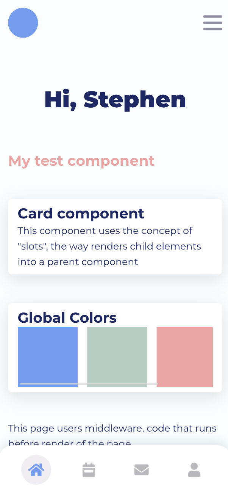

## Nuxt 2 Starter

A template project using a similar frontend to bonkers.
Example uses computed properties, local data, data stored in Vuex, i18n, global SCSS variables, and a default layout and page structure.

# How to run
Clone the project into a folder using `git clone`
Run `yarn` to install any packages needed.
Run locally on your machine with `yarn dev` which should default to localhost:3030

# Tech Stack
Nuxt 2
Vue 2
Vuex
i18n
Javascript
pug
scss
